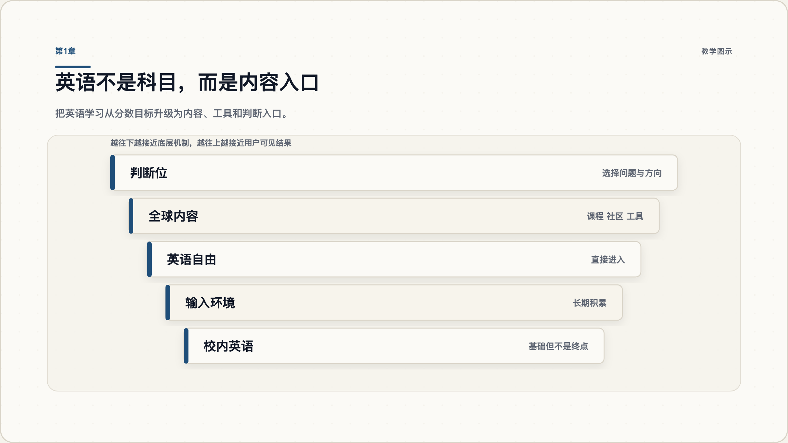
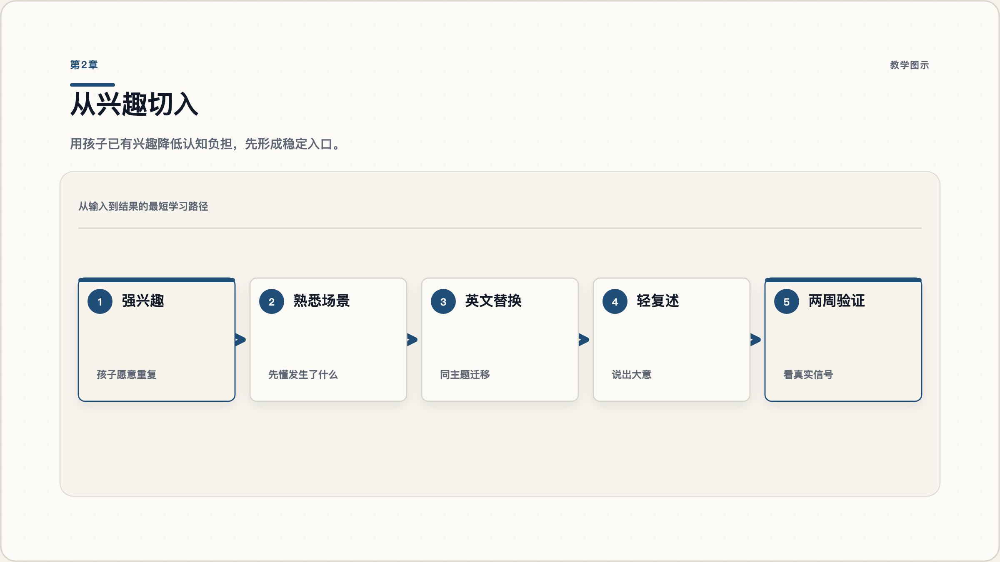
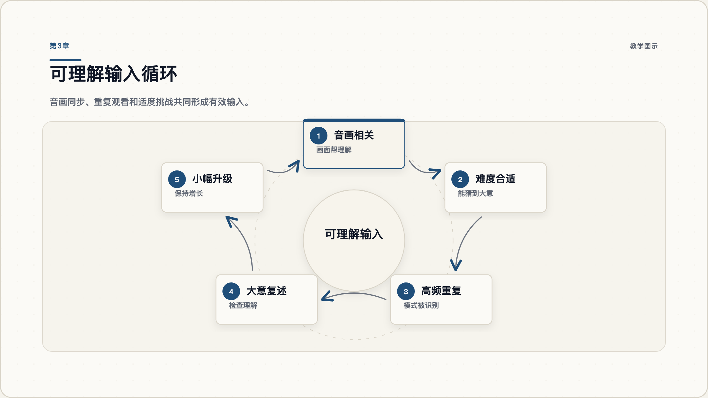
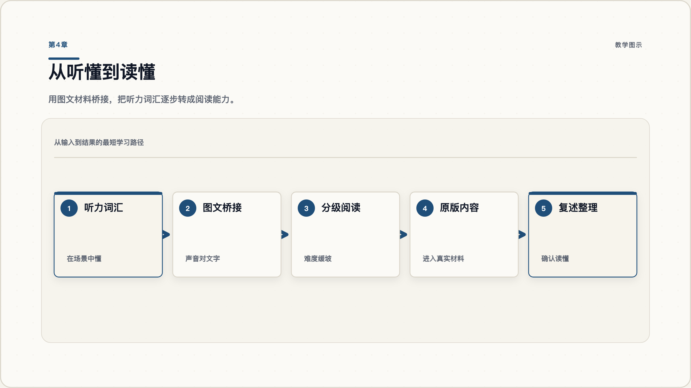
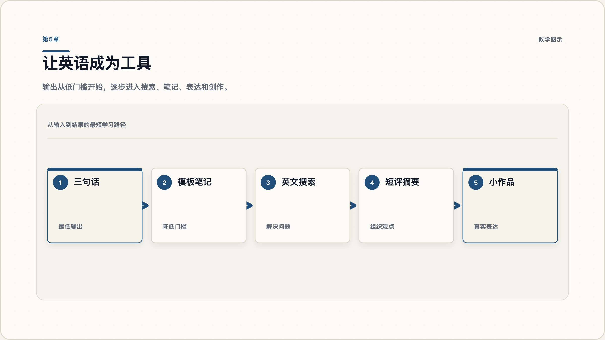
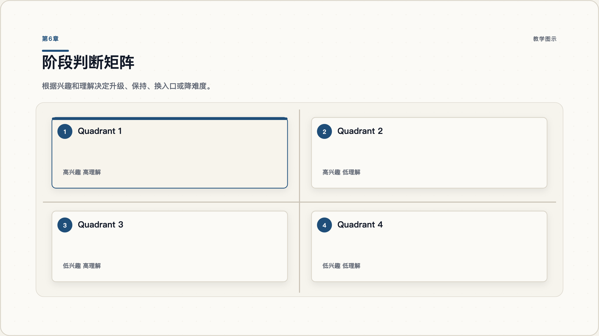
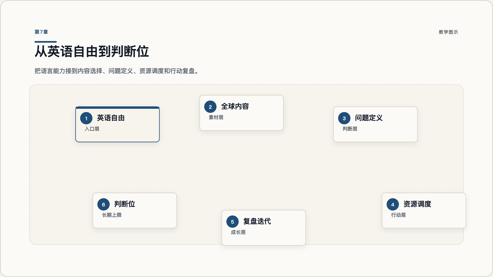

# 英语自由路线图：让孩子用英文打开全球内容世界

很多家庭一谈到英语，脑子里马上浮现的是背单词、讲语法、刷题、外教和考试分数。这些事情不是完全没有价值，但它们很容易把目标带窄：孩子可能做了很多题，却听不懂真实视频；可能背了很多单词，却读英文内容很慢；可能考试还不错，却依然不能用英文学习、搜索、表达和创作。

英语真正值得投入的地方，不只是多掌握一门学科，而是给孩子打开一个更大的内容世界。全球课程、科学解释、工程项目、创作者社区、前沿工具、开源文档、英文讨论区，大量高质量内容仍然以英语为第一入口。孩子越早能直接进入这些内容，越早能摆脱“等别人翻译、等别人筛选、等别人总结”的被动状态。

这份教程要解决的问题不是“怎样把英语学得更辛苦”，而是“怎样用更合理的家庭结构，让英语逐渐变成孩子的工具”。你会看到一条从浅入深的路径：先定义终点，再从兴趣启动；先搭建可理解输入，再桥接阅读；先做轻输出，再进入真实任务；最后用阶段判断把孩子从语言能力带向内容选择、问题定义和行动复盘。

家长不需要一开始就变成英语老师。更关键的角色，是学习系统的设计者：你负责选入口、搭环境、看信号、做校准。孩子负责在更好的内容环境里探索、积累、表达和成长。

## 第1章 先定义终点：英语不是科目，而是内容入口

### 1.1 从分数目标升级到内容目标

如果目标只是校内分数，英语学习自然会围绕课本、词表、语法点和题型展开。这条路能解决一部分考试问题，但很难自动通向“英语自由”。因为考试训练通常把语言拆成知识点，而真实世界里的英语是一种进入内容、工具和社群的能力。

更高一级的目标，是让孩子能用英语做事：看懂自己感兴趣的视频，读懂某个主题的图文资料，用英文搜索答案，听英文课程，用英文写简单笔记，甚至和 AI、社区或创作工具协作。此时，英语不再是一个孤立科目，而是内容入口。

这一步的认知转换非常重要。很多家长的问题不是资源太少，而是目标定义太低。目标低，执行动作就会被锁在背诵和纠错；目标高，家长才会开始思考：孩子真正想进入哪个内容世界？他现在缺的是词汇，还是入口？缺的是语法，还是持续输入？缺的是监督，还是更好的环境？



图 1：英语自由的终点不是多会几道题，而是能直接进入更大的内容世界。

### 1.2 英语自由的四个可观察信号

“英语自由”不要只用一个分数来判断。更好的办法，是看四个可观察信号。

第一，孩子能长时间进入英文内容。比如连续看一段英文视频，能知道发生了什么，而不是每一句都要翻译。

第二，孩子能从兴趣内容走向知识内容。早期可能是动画、游戏、故事，后面要逐步进入科普、课程、说明文、项目教程和真实创作者内容。

第三，孩子能用英文完成小任务。比如搜索一个问题、整理三条笔记、写一段短评、做一个小展示。

第四，孩子开始主动选择英文内容。真正的自由，不是被安排着学，而是发现英文内容能帮自己探索更大的世界。

这四个信号比单纯词汇量更有用。词汇量当然重要，但它应该是大量有效输入和真实任务的结果，而不是唯一入口。

### 1.3 家庭路径的第一张地图

你可以把家庭路径画成五层。

| 层级 | 家庭要解决的问题 | 典型动作 |
| --- | --- | --- |
| 目标层 | 英语到底服务什么 | 从分数目标升级到内容目标 |
| 入口层 | 孩子从哪里进入 | 找到强兴趣和熟悉场景 |
| 输入层 | 如何持续吸收 | 低难度视听输入和图文桥接 |
| 输出层 | 如何变成工具 | 复述、笔记、短评、小作品 |
| 判断层 | 如何持续升级 | 看兴趣、理解、复述、迁移四个信号 |

这张地图能避免一个常见错误：把所有问题都归因于孩子不努力。很多时候，真正的问题是家庭没有设计入口，材料难度不合适，阶段切换不准确，或者把英语长期停留在低层训练里。

本章的小行动：写下你希望孩子一年后能用英语完成的三个真实任务。不要写“背完多少单词”，而要写“能看懂什么、能读懂什么、能做成什么”。

## 第2章 找到启动点：从孩子熟悉的兴趣切入

### 2.1 兴趣为什么能降低入门阻力

早期英语输入最怕两件事：内容太陌生，语言又太难。孩子既不知道画面里发生什么，也听不懂声音里的意思，大脑就会迅速把它判断为无效刺激，最后只剩下抵触。

兴趣的价值，是帮孩子先解决“发生了什么”。如果孩子已经熟悉某个游戏、动画、运动、恐龙、乐高、宠物、手工或侦探故事，那么同主题英文内容就不是完全陌生的世界。画面、动作、人物、场景和任务会帮助孩子猜测语言意义，认知负担会明显降低。

所以启动点不是“最系统的教材”，而是“孩子愿意反复进入、并且能借助场景理解的英文内容”。一旦入口找对，家长就不需要每天靠催促维持学习，孩子会因为内容本身而回来。



图 2：好的启动点不是最专业的材料，而是孩子愿意反复进入的英文入口。

### 2.2 把中文兴趣迁移为英文入口

迁移兴趣时，不要突然把孩子推到完全陌生的英文世界。更稳的路径是“同主题、同场景、低一点难度”。

假设孩子喜欢 Minecraft。第一步不是找英语教材，而是找同主题英文解说、建造教程或低龄创作者视频。孩子已经知道方块、工具、怪物、建筑、任务和玩法，英文只是覆盖在熟悉场景上的新声音。

假设孩子喜欢恐龙。可以先看低龄英文恐龙动画，再看短科普，再看图文书，最后进入更长的纪录片或课程片段。

假设孩子喜欢悬疑故事。可以先从有画面、有情节、语速较慢的短故事开始，再进入分级读物和字幕剧集。

迁移的关键不是“英文越纯越好”，而是“孩子能不能在英文里继续保持兴趣”。如果兴趣断了，输入系统就断了。

### 2.3 用两周实验验证真实兴趣

不要一开始就做一年规划。先跑一个两周实验。

| 项目 | 设计方法 |
| --- | --- |
| 选择主题 | 只选一个强兴趣，不要同时铺太多 |
| 准备内容 | 找 5-8 个同主题英文视频或图文材料 |
| 每日动作 | 15-30 分钟，不要求背诵 |
| 家长观察 | 看孩子是否愿意回来，是否能说出大意 |
| 两周决策 | 升级、保持、换入口、降难度 |

两周后，如果孩子愿意主动看，能说出大意，并且不明显焦虑，就说明入口可能成立。如果孩子抗拒，先不要责怪他，大概率是主题、难度、形式或节奏不合适。

本章的小行动：列出孩子最强的三个兴趣，从中选择一个最容易找到英文材料的兴趣，做两周实验。

## 第3章 搭建输入系统：让视听内容变成可理解输入

### 3.1 低难度视听内容的选择标准

视听输入不是简单地“多看英文视频”。真正有效的是可理解输入：孩子不一定逐字听懂，但能借助画面、动作、上下文和已有经验，持续猜到大意。

选择材料时，看四个标准。

第一，音画相关。画面正在发生的事，要能帮助理解语言。如果画面和语言关系弱，孩子很难通过视觉降低难度。

第二，主题熟悉。越早期，越要选孩子已经有经验的主题。

第三，难度缓坡。不要从短动画直接跳到高密度访谈，也不要从生活场景突然跳到抽象演讲。

第四，可重复。孩子愿意重复看，才会形成模式识别。语言学习里很多“突然听懂”，背后都是大量重复输入。



图 3：视频有用的前提，是它能变成可理解输入，而不是单纯增加屏幕时间。

### 3.2 字幕、语速和重复观看怎么用

字幕不是非开不可，也不是绝对不能开。更重要的是字幕服务于哪个阶段。

早期，如果孩子完全抓不到声音，可以用英文字幕帮助声音和文字对齐。不要长期依赖中文字幕，因为中文字幕容易让孩子绕回“英文声音-中文翻译-意义”的慢路径。

中期，可以让孩子先不开字幕看一遍，再开英文字幕确认关键词。这样既训练听力，又能建立文字连接。

后期，可以减少字幕，把注意力放到内容结构、观点、论证和表达上。

语速也一样。真实内容语速可能很快，但早期不需要硬扛。可以先用低龄内容、慢速内容、熟悉主题内容启动，再逐步升级到普通语速。升级幅度要小，让孩子始终处在“有挑战但不崩溃”的区间。

### 3.3 从听不懂到大意理解的观察表

家长不需要每天考单词，可以用观察表判断输入是否有效。

| 信号 | 说明 | 下一步 |
| --- | --- | --- |
| 能说出人物和事件 | 抓住了故事大意 | 继续同主题输入 |
| 能复述一个关键动作 | 音画意义开始连接 | 加入英文字幕或图文材料 |
| 能识别重复词 | 语言模式正在形成 | 保持重复和小幅升级 |
| 能主动找相似内容 | 入口开始稳定 | 扩展到同主题更长内容 |
| 完全说不出发生什么 | 难度过高或兴趣不够 | 降难度或换入口 |

本章的小行动：选一个英文视频，让孩子看完后只回答一个问题：“刚才发生了什么？”如果他说不出来，不急着讲解，先换更熟悉或更简单的内容。

## 第4章 打通阅读桥：把听力词汇转成阅读能力

### 4.1 先图文材料，再进入纯文字

很多孩子能听懂一些英文视频，却一读英文书就卡住。原因很简单：听懂不等于读懂。声音、画面和动作曾经帮他理解，但纯文字把这些线索拿掉了。

所以阅读不要突然开始。更好的桥是图文材料：绘本、分级读物、视频配套文本、带图解的科普短文、操作说明、漫画式教程。图像继续降低理解负担，文字开始把听力词汇固定下来。

这里最重要的是建立直接连接。看到一个英文词，尽量直接连到场景、动作或概念，而不是每次都绕到中文翻译。翻译可以偶尔帮助解释，但不能成为长期拐杖。



图 4：阅读不是突然开始硬啃原版书，而是把听过、见过、懂过的内容文字化。

### 4.2 从分级读物走向原版内容

阅读升级可以分四步。

第一步，同主题图文。孩子听过恐龙，就读恐龙图文；看过游戏教程，就读简单说明。

第二步，分级读物。让语言难度形成缓坡，不要一上来追求厚书。

第三步，短章节原版。选择故事性强、章节短、情节清楚的内容。

第四步，真实内容。进入课程讲义、项目说明、科普文章、工具文档和英文社区材料。

阅读的目标不是“显得高级”，而是让孩子进入更高密度的信息。只要材料能推动理解和兴趣，就比硬啃不适合的名著更有效。

### 4.3 用复述检查是否真的读懂

复述是最温和的检查方式。不要一上来做阅读理解题，可以让孩子完成三种轻复述：

| 复述方式 | 适合阶段 | 示例 |
| --- | --- | --- |
| 发生了什么 | 初期 | 这篇讲了一个人如何解决问题 |
| 我学到什么 | 中期 | 我知道了三种恐龙防御方式 |
| 我怎么使用 | 后期 | 下次我可以用这个方法搭建模型 |

复述不要求完美英文。早期可以中英混合，重点是看孩子是否真的抓住结构。等理解稳定后，再逐步增加英文表达比例。

本章的小行动：给孩子一篇同主题短图文，让他画出三个关键词，再用自己的话讲一遍。

## 第5章 加入输出：让英语成为思考与创作工具

### 5.1 输出从三句话开始

很多家长一提输出，就想到作文、演讲、口语考试。这个门槛太高，容易让孩子退回沉默。输出的第一步可以非常小：三句话。

看完一个视频后，写三句话：

```text
I watched...
I learned...
I want to try...
```

读完一篇短文后，写三句话：

```text
This article is about...
The most interesting part is...
My question is...
```

这类三句话输出，不追求华丽，只追求把输入变成自己的表达。孩子一旦能稳定输出，就不再只是内容消费者，而开始成为整理者和创造者。



图 5：自由不是只输入，孩子要能用英语完成一个真实的小任务。

### 5.2 用模板降低写作门槛

输出困难，很多时候不是孩子没有想法，而是不知道结构。模板可以降低门槛。

| 任务 | 模板 |
| --- | --- |
| 视频笔记 | What happened? Why is it interesting? What can I try? |
| 读书摘要 | This part explains... The key idea is... An example is... |
| 项目记录 | I built... The problem was... I fixed it by... |
| 观点表达 | I think... because... For example... |

模板不是束缚，而是脚手架。等孩子熟悉表达结构后，就可以逐步拿掉。

### 5.3 把英文用于真实任务

输出最好的场景，是真实任务。比如：

- 用英文搜索一个游戏建造方法。
- 看英文教程做一个科学小实验。
- 给一个英文视频写三句评论。
- 用英文整理一份工具使用清单。
- 把自己做的小项目写成英文说明。

真实任务会带来即时反馈。孩子不是为了完成作业而写，而是因为英文能帮他解决问题、表达想法、展示作品。

本章的小行动：选择一个孩子已经看懂的英文内容，让他完成一张“三句话卡片”。目标不是写得漂亮，而是开始表达。

## 第6章 判断阶段：什么时候升级、保持、换入口或降难度

### 6.1 四个信号：兴趣、理解、复述、迁移

英语路径最难的部分，不是找资源，而是判断阶段。过早升级会挫败，过迟停留会浪费，不升级会停在娱乐消费里，频繁换入口又会破坏积累。

家长可以看四个信号。

兴趣：孩子是否愿意主动进入？
理解：孩子是否能说出大意？
复述：孩子是否能整理关键点？
迁移：孩子是否能换一个相近材料继续理解？

四个信号一起看，比单看“今天学了多久”更准确。



图 6：阶段判断决定路径质量：过早升级会挫败，过迟停留会浪费。

### 6.2 一张家庭阶段决策表

| 信号组合 | 判断 | 动作 |
| --- | --- | --- |
| 高兴趣，高理解，能复述 | 可以升级 | 换更长、更深、更少字幕的内容 |
| 高兴趣，低理解 | 保持辅助 | 降低难度，加英文字幕，换同主题简单材料 |
| 低兴趣，高理解 | 换入口 | 保留难度，换孩子更关心的主题 |
| 低兴趣，低理解 | 降难度 | 回到更具象、更短、更熟悉的内容 |
| 能听懂但不愿读 | 桥接阅读 | 找视频对应图文，不直接上纯文字 |
| 能读懂但不输出 | 加轻输出 | 从三句话、清单、复述开始 |

这张表的作用，是让家长从焦虑反应变成结构判断。孩子卡住时，先判断卡在哪里，再调整系统。

### 6.3 少干预，但要会校准

少干预不是不管。少干预是减少无效纠错，把精力放在关键校准上。

不要每句话都纠音，不要每个词都追问，不要把兴趣内容变成随堂考试。这样会破坏孩子对英文内容的自然进入感。

但你要定期校准：内容是否太低？是否太难？是否长期只有娱乐没有知识？是否该从视频转图文？是否该加入输出？是否该换更高质量的内容源？

本章的小行动：每周只做一次 10 分钟复盘。不要每天盘问，把观察留到固定时间。

## 第7章 建成系统：从英语自由走向判断位

### 7.1 三层路径：刷题、大量输入、全球内容

英语学习可以分成三层。

第一层是刷题和知识点训练。它能服务考试，但不一定带来自由。

第二层是大量输入。孩子开始听得懂、读得多，语言能力明显提升。

第三层是接入全球内容。孩子用英文进入课程、社区、项目、工具、创作和真实问题。到了这一层，英语才真正变成通向更大世界的接口。

这三层不是互相排斥。校内基础仍然需要，输入积累也很重要。但如果长期停在前两层，英语的上限就会被限制。真正的长期价值，是让孩子用英语看见更多问题、更多方法和更多可能性。



图 7：语言只是入口，能否用内容做判断和行动，才决定长期上限。

### 7.2 家庭每周复盘仪表盘

你可以用一个简单仪表盘管理路径。

| 指标 | 本周观察 | 下周动作 |
| --- | --- | --- |
| 兴趣入口 | 孩子主动进入了哪些英文内容 | 保留、替换或扩展 |
| 输入质量 | 内容是否可理解、有画面、有重复 | 升级或降难度 |
| 阅读桥接 | 是否接触图文或短文本 | 加一篇同主题材料 |
| 输出行为 | 是否完成复述、笔记或三句话 | 降低门槛或加模板 |
| 内容密度 | 是否从娱乐走向知识、项目或创作 | 引入更高密度材料 |
| 判断能力 | 是否能说出喜欢什么、难在哪里 | 引导孩子自己复盘 |

仪表盘不需要复杂。真正重要的是每周做一次小决策，而不是长期凭感觉漂移。

### 7.3 下一步行动清单

最后，把整条路径压缩成 7 个动作。

1. 写下孩子一年后要用英语完成的三个真实任务。
2. 选择一个强兴趣作为英文入口。
3. 准备 5-8 个同主题、低难度、音画相关的英文材料。
4. 跑一个两周实验，只观察兴趣、理解、复述、迁移。
5. 用图文材料把听力词汇桥接到阅读。
6. 用三句话模板启动轻输出。
7. 每周复盘一次，决定升级、保持、换入口或降难度。

英语自由不是一天搭好的，也不是靠某个神奇资源自动发生的。它更像一个家庭系统：目标要清楚，入口要合适，输入要持续，阅读要桥接，输出要低门槛，阶段要会判断。

当孩子开始用英文主动进入内容世界，英语就不再只是学习任务，而成为他探索世界的工具。再往后，真正值得培养的就不只是语言能力，而是能否在更大的内容世界里选择问题、判断价值、调度资源，并把想法变成行动。
