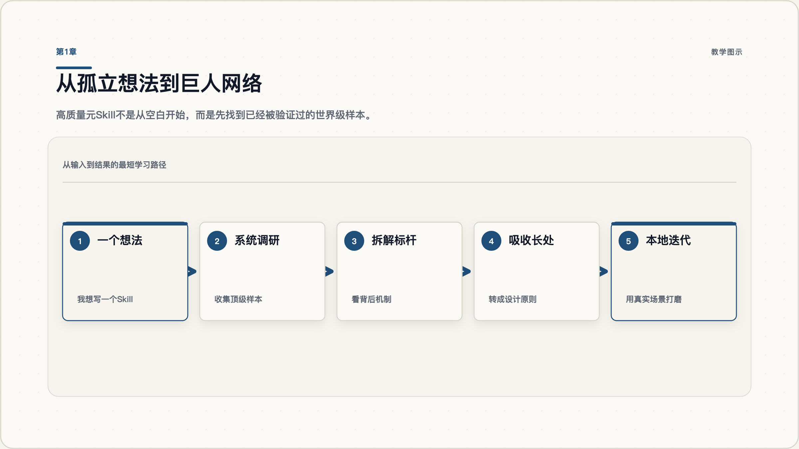
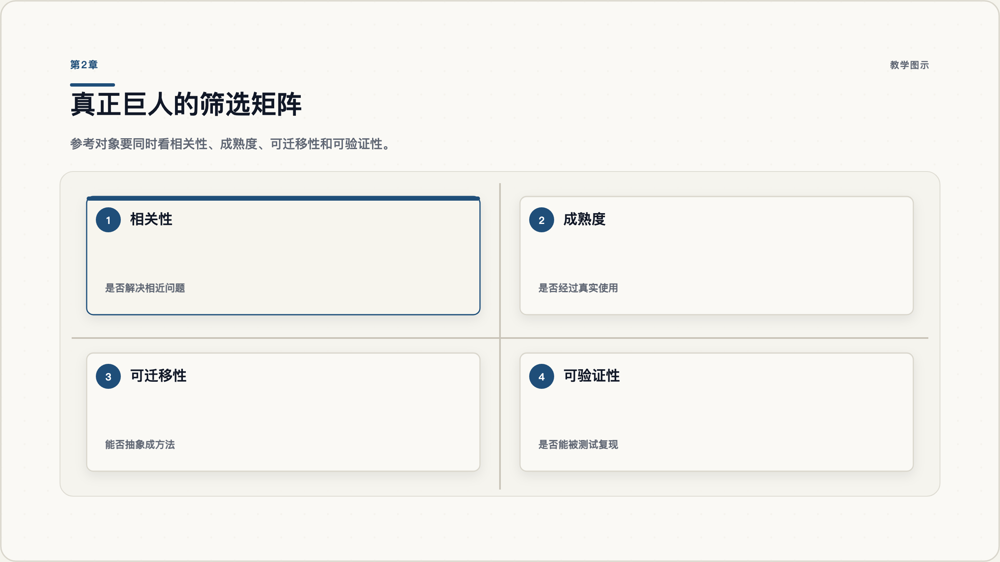
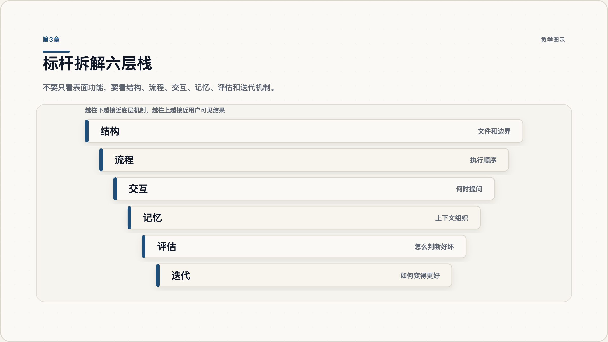
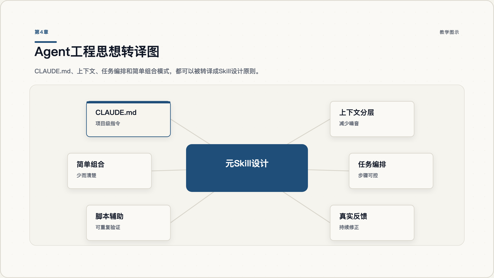
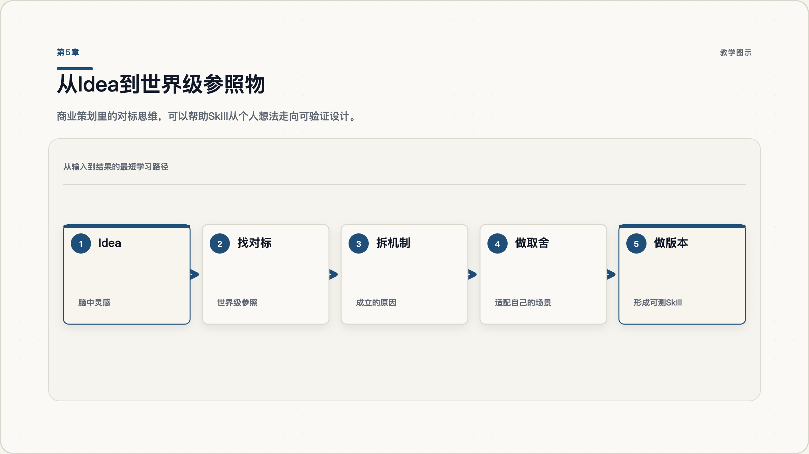
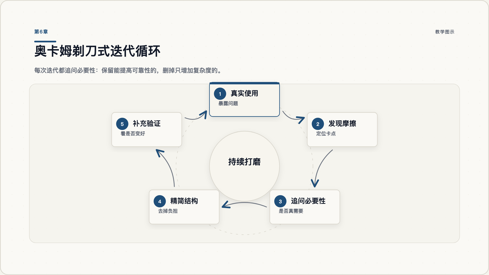
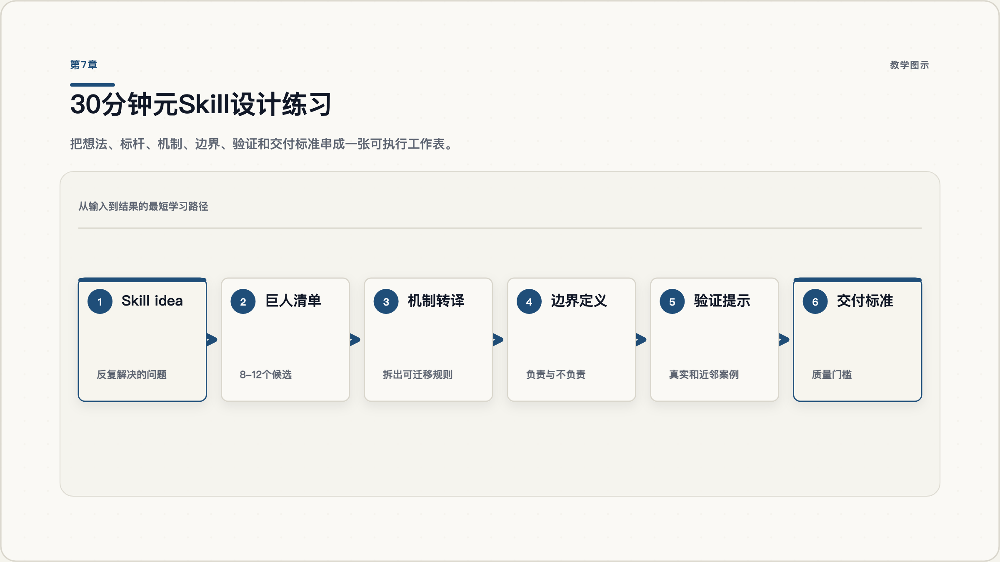

# 如何写出高质量元Skill：站在真正巨人的肩膀上

你想写一个很强的 Skill，第一反应可能是：我是不是应该写一段更完整、更细、更厉害的提示词？

这正是很多人卡住的地方。

真正高质量的元Skill，不是靠灵感把一堆要求写进 `SKILL.md`，也不是把所有想到的流程都塞进去。它更像一套小型研发方法：先找到这个世界上已经做得最好的样本，拆解它们为什么有效，再把适合自己的部分转成可执行流程，最后在真实使用里一点点打磨。

这篇教程会带你完成一条路径：

1. 先换问题：从“我怎么写”变成“谁已经做对了”。
2. 找到真正的巨人：不是随便找参考，而是筛选顶级样本。
3. 拆解标杆：看结构、流程、交互、记忆、评估和迭代。
4. 吸收工程思想：把 Agent 体系里的好原则转译进元Skill。
5. 引入商业对标：让一个 idea 先找到世界级参照物。
6. 用奥卡姆剃刀迭代：让 Skill 越改越清楚，而不是越改越重。

## 本版使用方式

这不是一篇只适合读完点头的文章，而是一份可以照着做的工作手册。建议你准备一个真实想写的 Skill 主题，边读边填自己的表格。每一章都对应一个动作：找标杆、筛标杆、拆标杆、转译工程思想、寻找商业参照、做简化迭代。读完之后，你应该至少能产出三样东西：一张标杆清单，一张机制拆解表，一份第一版 Skill 边界说明。

如果你只是想获得观点，可以快速浏览每一章的开头和图示；如果你想真正提升写 Skill 的能力，请完成每章后的检查点。元Skill 不是靠理解概念变强的，而是靠一次次把模糊想法转成可执行流程变强的。

## 第1章 先换一个问题

图 1.1：第一步不是写，而是先找到值得站上去的肩膀。

写元Skill时，新手最容易问的问题是：“我要怎么把这件事写清楚？”

更好的第一个问题是：“这个世界上，谁已经把类似问题做对了？”

这就是“站在真正巨人的肩膀上”的起点。你不是从零开始发明方法，而是先承认：很多复杂问题，顶级团队、顶级产品、顶级开源项目、顶级方法论作者已经探索过。你的任务不是崇拜他们，而是把他们的有效方法拆出来，转成自己的工作流。

这和教程设计也很像。好的教程不是把道理讲满，而是让学习者通过一个个有意义的小任务建立理解。所以我们这一课的第一个小任务很简单：

**不要先写 Skill。先列出你要研究的“巨人名单”。**

### 1.1 从问题切换开始

拿出一个你想写的元Skill主题，比如“写营销文章的 Skill”“做数据分析的 Skill”“创建课件的 Skill”。然后列出四类可能的巨人：

| 类型 | 你要找什么 | 例子 |
|---|---|---|
| 官方样本 | 平台或团队已经发布的 Skill、Agent、工作流 | Anthropic Skills、GitHub Skills |
| 工程样本 | 解决相似工程问题的系统 | CLAUDE.md、可复用 workflow、Agent 编排实践 |
| 产品样本 | 相似场景里做得成熟的产品 | 学习平台、内容生产系统、自动化工具 |
| 方法样本 | 可迁移的理论和原则 | Diataxis、奥卡姆剃刀、精益迭代 |

### 1.2 避免把普通参考当巨人

不是所有参考都叫“巨人”。一个链接很火、一个项目 star 很多、一个帖子被转发很多，都只能说明它值得看看，不能说明它值得学习。

你真正要找的是：它是否在相近问题上经过验证，是否有清晰结构，是否能拆出可迁移的方法。

### 1.3 示例：把“写教程 Skill”变成研究任务

假设你想写一个“自动生成教程的 Skill”。普通做法是直接写要求：帮我调研、生成大纲、写正文、导出 PDF。这样当然能跑，但它很容易变成一个大号提示词。更好的做法是先问：世界上谁最擅长“教程”？谁最擅长“文档排版”？谁最擅长“Agent 工作流”？谁最擅长“可复用能力包”？

于是你的研究对象会变成四组：Diataxis 这样的教程方法论，kami 这样的出版排版系统，Anthropic Skills 这样的 Skill 组织方式，以及 GitHub Skills 这样的真实练习产品。你不是要把它们合成一个大杂烩，而是分别学习它们最强的一个点：Diataxis 负责学习路径，kami 负责文档质感，Anthropic Skills 负责渐进披露，GitHub Skills 负责真实任务感。

### 1.4 列出第一批候选标杆

如果你现在要写一个元Skill，你能列出至少 8 个候选参考对象吗？其中有没有官方样本、工程样本、产品样本和理论样本？

## 第2章 怎么找到真正的巨人

图 2.1：普通样本带来普通方法，顶级样本才可能带来顶级方法。

参考标的的选择，本身就是能力。

这句话很重要。因为很多人做调研，只是在搜索结果里挑几个看起来相关的链接。这样很容易学到“平均水平”。如果你找到的是普通样本，最后学到的就是普通方法；如果你找到的是顶级样本，才可能逼近顶级方法。

筛选巨人，可以用四个问题：

1. **相关性**：它解决的问题和我的问题足够接近吗？
2. **成熟度**：它是否被真实用户、真实团队、真实项目使用过？
3. **可迁移性**：它的做法能不能抽象成原则，而不是只能在原平台里成立？
4. **可验证性**：我能不能用样例、测试、输出质量来判断它是否真的有效？

比如，成熟的 Agent 工程实践常常强调简单、可组合的模式，而不是一上来追求复杂框架。这对元Skill设计很有启发：如果一个 Skill 可以用清楚的入口、少量参考文件和一个验证脚本解决，就不要急着做成庞大系统。

GitHub Skills 则提供另一个方向：它强调真实项目、真实工作流和互动练习。这提醒我们，Skill 不应该只是一段静态说明，而应该能把用户带进一个可完成的任务。

### 2.1 给标杆打四维分

给每个候选标杆打分：

| 标杆 | 相关性 | 成熟度 | 可迁移性 | 可验证性 | 是否进入拆解 |
|---|---:|---:|---:|---:|---|
| 官方 Skill A | 5 | 4 | 4 | 5 | 是 |
| 热门帖子 B | 3 | 2 | 3 | 1 | 只作线索 |
| 开源项目 C | 4 | 5 | 4 | 4 | 是 |

你不需要一开始就找 50 个。先找 8-12 个候选，再选出 3-5 个真正值得深拆的对象。

### 2.2 筛选时的三个优先级

第一优先级是“真实使用”。一个标杆如果已经被真实团队、真实项目、真实用户反复使用，它通常比一个漂亮但未经验证的样例更值得拆。比如官方文档、长期维护的开源仓库、成熟产品的公开流程，都比单篇观点文章更稳定。

第二优先级是“结构清晰”。有些作品效果很好，但你无法拆出它为什么好；有些作品虽然不华丽，却把边界、流程、输入、输出、检查项写得很清楚。写元Skill时，后者往往更值得学习，因为它能转化成你自己的执行规则。

第三优先级是“可迁移”。你要警惕只在原平台、原团队、原数据里成立的做法。一个机制只有能从原环境里抽象出来，才适合放进你的 Skill。否则你学到的不是方法，而是别人的上下文。

### 2.3 常见坑

**坑：把热度当质量。**

X.com 上关于 Skill、CLAUDE.md、Agent 工作流的讨论很多，有些帖子很有启发，比如有人总结项目记忆的社区实践，有人指出 prompt-only Skill 也可能有高杠杆，也有人把 Skill 分成不同复杂度层次。但这些都应该先当作实践信号，而不是最终结论。重要判断还要回到官方文档、可运行样本和你自己的测试。

### 2.4 用一句话说明为什么值得学

你选出的 3-5 个标杆，是否每个都能回答“为什么它值得学”？

## 第3章 拆解标杆，不抄表面功能

图 3.1：拆解越深入，能迁移的就越多。

找到巨人之后，下一步不是照抄。

很多人看一个好 Skill，只会看它有哪些功能、用了哪些标题、文件夹怎么命名。这样只能学到表皮。真正有价值的是背后的设计思路。

你可以从六层拆解：

| 层级 | 你要看什么 | 拆解问题 |
|---|---|---|
| 结构 | 文件、入口、引用关系 | 它为什么这样分层？什么放在 SKILL.md，什么放在 references？ |
| 流程 | 执行步骤 | 它先做什么，后做什么？哪里会暂停确认？ |
| 交互 | 和用户如何配合 | 它什么时候问问题，什么时候自己推进？ |
| 记忆 | 如何组织上下文 | 它如何避免每次都重新解释背景？ |
| 评估 | 如何判断好坏 | 它有没有样例、测试、检查清单？ |
| 迭代 | 如何变得更好 | 它如何吸收反馈，而不是一次写死？ |

成熟 Skill 的创建范式通常强调保持入口文件精简，把大型参考内容放到外部文件，并用真实测试提示迭代。项目记忆机制则展示了项目指令、用户指令、组织级指令等不同层级。这些都不是要你复制路径，而是提醒你：上下文应该分层，规则应该有作用域，入口不应该无限膨胀。

### 3.1 用拆解表看结构和机制

选一个你认为最强的 Skill 或 Agent 工程样本，填一张拆解表：

| 维度 | 我看到的做法 | 我能学走的原则 | 我不该照搬的部分 |
|---|---|---|---|
| 结构 | 入口短，参考文件多 | 渐进披露 | 文件名不必完全一致 |
| 评估 | 有测试 prompt | 用真实场景验证 | 不必一开始做完整评测平台 |

### 3.2 常见坑

**坑：把形式当方法。**

比如你看到别人有 `references/` 文件夹，就也建一个。但如果你的 Skill 很小，根本没有大块参考资料，硬建文件夹只是增加噪音。真正要学习的是：当入口过长时，把低频细节移动到外部参考文件。

### 3.3 拆解时要保留“反面发现”

拆标杆时，不只记录它哪里好，也要记录它哪里不适合你。这个动作很关键。因为很多人一看到顶级样本，就会默认它所有选择都正确。但任何设计都有场景。官方 Skill 往往更通用、更稳妥；个人或团队内部 Skill 可以更垂直、更激进、更贴合自己的业务。你要学的是它解决问题的方式，而不是它对每个权衡的最终选择。

建议在拆解表里增加一列“我不该照搬的部分”。例如，一个平台官方 Skill 为了覆盖更多用户，可能会把流程写得非常保守；而你的内部 Skill 面向固定团队，可以把术语、目录、输出路径、审美偏好都写得更具体。这个差异不是谁对谁错，而是场景不同。

### 3.4 说出功能背后的原则

你能说出一个标杆“表面功能背后的原则”吗？如果只能说功能，说明还没有拆透。

## 第4章 把 Agent 工程思想放进元Skill

图 4.1：工程思想的价值不在术语，而在它能让 Skill 更可控。

项目记忆、上下文分层、任务编排这些工程原则，本来常用于指导 Agent 和代码助手工作，但同样适用于元Skill设计。

这就是“转译”的能力。

你不是把 CLAUDE.md 的所有机制搬进 Skill，而是问：它解决了什么工程问题？

例如：

- 项目级记忆解决的是长期指令和团队共享上下文的问题。
- Agent 工程里的简单可组合模式，解决的是系统过度复杂、难以维护的问题。
- 可复用工作流解决的是重复配置、中心化维护和可信引用的问题。

把这些转译成 Skill 设计语言，就会得到：

| 外部工程思想 | 转译成元Skill原则 |
|---|---|
| 项目级记忆 | Skill 要记录稳定偏好、边界和工作流 |
| 上下文分层 | 高频规则放入口，低频细节放 references |
| 简单可组合 | 先做最小可靠路径，不急着堆集成 |
| 可复用工作流 | 把可重复步骤脚本化或模板化 |
| 真实反馈 | 用实际输出和用户反馈迭代 |

这一步会让 Skill 从“提示词”变成“工程化工作流”。

### 4.1 什么时候需要脚本，什么时候只需要规则

并不是所有 Skill 都需要脚本。一个常见误区是：一提到工程化，就立刻加 Python、加浏览器自动化、加复杂目录。实际上，脚本只应该用于重复、确定、可验证的动作。例如导出文件、校验 JSON、生成图示、批量截图，这些适合脚本。审美判断、来源取舍、教学节奏，这些更适合写成规则和检查清单。

判断标准很简单：如果这个动作每次都按同样方式执行，并且机器比人更稳定，就脚本化；如果这个动作需要语境、取舍和判断，就把判断原则写清楚。高质量元Skill通常是“清晰规则 + 少量关键脚本”的组合，而不是“全靠提示词”或“全靠工具链”。

### 4.2 写一张工程思想转译表

给你的元Skill写一张“工程思想转译表”：

| 我借鉴的外部系统 | 它解决的问题 | 我转译成的 Skill 规则 |
|---|---|---|
| CLAUDE.md | 项目上下文复用 | 在 SKILL.md 里只保留稳定入口规则 |
| 可复用 workflow | 避免重复劳动 | 把导出、校验、生成等动作脚本化 |
| Agent 简单组合模式 | 降低系统复杂度 | 第一版只保留一个主路径 |

### 4.3 常见坑

**坑：只借术语，不借问题。**

如果你只是把“上下文管理”“任务编排”“记忆”这些词写进 Skill，但没有说明它们解决什么问题，Skill 仍然不会变强。

### 4.4 检查原则减少了什么混乱

你写下的每条工程原则，能不能回答：“它减少了什么重复、混乱或错误？”

## 第5章 用商业策划找世界级参照物

图 5.1：对标不是复制，而是理解别人为什么成立。

一个 idea 在脑子里通常都很美。但只在脑子里转，很容易自嗨。

商业策划里有一个很朴素但很重要的动作：找对标对象。你要问，这个想法在世界上有没有相似形态？谁做得最好？它为什么成立？它的用户是谁？它靠什么路径获得结果？

写元Skill也一样。

如果你想做一个“自动生成教程的 Skill”，不要只问“我想让它输出什么”。你要去看：

- 最好的教程框架如何设计学习路径？
- 最好的文档体系如何区分教程、指南、解释和参考？
- 最好的 Agent Skill 如何组织入口和参考材料？
- 最好的产品化工具如何把复杂工作流变成可操作步骤？

成熟互动教程的价值就在于，它不是让学习者看一个抽象说明，而是把学习放进真实工作流里。这对 Skill 的启发是：好的 Skill 输出不应该只是“看起来完整”，还应该让用户完成一件真实事情。

### 5.1 用五步寻找世界级参照物

对你的 Skill idea 做一次“世界级参照物”练习：

1. 写下你的 idea：例如“帮我生成一套教程”。
2. 找 5 个相似参照：官方 Skill、开源工具、顶级教程体系、成熟产品、经典方法。
3. 对每个参照回答三个问题：
   - 它为什么成立？
   - 它最强的机制是什么？
   - 我能迁移哪一个机制？
4. 最后只保留 2-3 个真正进入设计的机制。

### 5.2 常见坑

**坑：对标变成模仿。**

对标不是复制页面、复制目录、复制风格。对标是理解别人为什么能成立，然后回到你的用户、场景和约束里重新设计。

### 5.3 把对标结果变成自己的版本

对标之后，不要马上写完整 Skill。先写一份“机制转译清单”。每个机制只保留三句话：它来自哪里，它解决什么问题，我在自己的 Skill 里怎么实现。比如“来自 kami 的出版级排版纪律，解决教程输出不够正式的问题，在我的 Skill 中体现为 HTML/PDF/Word 统一的暖纸风格、标题层级、图片说明和固定目录”。这样的描述比“参考 kami 的风格”更有用，因为它明确了迁移对象和落地方式。

再比如“来自 frontend-slides 的密度控制，解决页面塞太满的问题，在我的 Skill 中体现为每章只讲一个核心问题、每张配图只解释一个关系、HTML 目录固定但不遮挡正文”。这样你就不是借名气，而是在借机制。

### 5.4 确认机制来自哪里

你的 Skill 里有没有一个机制，是明确从世界级参照物里拆出来、再本地化改造的？

## 第6章 用奥卡姆剃刀做持续迭代

图 6.1：好的迭代不是越写越多，而是越来越清楚。

很多 Skill 第一版不差，第二版开始变重，第三版就变成一团。

原因通常不是作者不努力，而是每次遇到问题都加一条规则、加一个分支、加一个文件。久而久之，Skill 变成了“所有特殊情况的堆积”。

奥卡姆剃刀能提醒我们：不要无必要地增加结构。放到 Skill 里，它不是让你写得越短越好，而是让你不断追问：

- 这个章节是否必要？
- 这个步骤是否必要？
- 这个判断能否更清晰？
- 这个流程能否更短？
- 这个复杂度有没有带来真实可靠性？

高质量元Skill的方法也体现了类似思想：先定义边界，做参考扫描，写触发描述，再按风险选择必要的门槛，而不是一开始堆满所有治理和评估。

### 6.1 用四步做最小迭代

每次迭代一个 Skill，只做四步：

1. **记录真实问题**：用户在哪里卡住？输出哪里不稳定？
2. **定位原因**：是边界不清、步骤缺失、资料不够，还是评估没有？
3. **选择最小修复**：只加能解决问题的最小规则、模板或脚本。
4. **重新验证**：用同一个或相似测试 prompt 看结果是否更好。

你可以用这张表：

| 真实问题 | 原因判断 | 最小修复 | 验证方式 | 是否保留 |
|---|---|---|---|---|
| 输出太泛 | 没有定义目标读者 | 增加 audience 字段 | 同主题重跑 | 保留 |
| 入口太长 | 把低频细节塞进 SKILL.md | 移到 references | 看触发是否更清晰 | 保留 |
| 章节太多 | 想覆盖所有情况 | 删除低频分支 | 看主路径是否顺畅 | 删除 |

### 6.2 常见坑

**坑：把复杂当专业。**

复杂不等于专业。专业是知道哪些复杂度值得保留，哪些复杂度只是心理安慰。

### 6.3 判断一个章节是否应该留下

可以用四个问题判断：第一，它是否服务核心输出？第二，它是否减少了真实错误？第三，它是否能被复用三次以上？第四，它是否有明确的触发条件？如果四个问题里只有一个答案是“是”，这个章节大概率不应该进入第一版 Skill。

这也是为什么官方平台 Skill 看起来不一定“极致”。平台团队面对的是大规模用户、生态安全、工具链一致性和通用场景。它们的很多取舍是为了稳。个人或团队内部 Skill 则可以沿着自己的场景持续打磨，做到更窄、更深、更有审美、更贴合实际工作流。理解这个差异，你就不会简单地说“官方做得不够好”，而会更准确地说：官方解决的是平台问题，我要解决的是我的场景问题。

### 6.4 判断最近新增规则是否必要

你最近给 Skill 增加的一条规则，是否真的解决了一个真实问题？如果没有证据，它可能只是噪音。

## 第7章 最终练习：用 30 分钟设计一个元Skill

图 7.1：最终练习把前六章的方法压缩成一次可执行的元Skill设计流程。

选一个你想写的 Skill，用下面模板做一版小设计。

### 7.1 我的 Skill idea

一句话说明它要反复解决什么问题。

### 7.2 我找到的巨人

列出 8-12 个候选参考对象，并用相关性、成熟度、可迁移性、可验证性筛选出 3-5 个。

### 7.3 我拆出的机制

至少写 3 个：

- 从哪个标杆来？
- 它解决什么问题？
- 我如何转译进自己的 Skill？

### 7.4 我的第一版 Skill 边界

写清楚：

- 它负责什么？
- 输出什么？
- 不负责什么？
- 什么内容放在 `SKILL.md`？
- 什么内容放到 `references/` 或 `scripts/`？

### 7.5 我的第一轮验证

写 3 个真实测试 prompt。不要只写理想案例，也要写一个容易误触发的近邻案例。

### 7.6 我的审美与交付标准

写下你的输出物标准。很多 Skill 最后失败，不是因为不会执行，而是因为“好”的标准太模糊。比如教程类 Skill 至少要明确：

- 正文长度：默认 5000-10000 字，除非用户要求短版。
- 章节数量：默认 6-10 章，每章只解决一个学习问题。
- 配图标准：每章一张结构图、模型图、流程图或矩阵图，不能用装饰图凑数。
- HTML 标准：有固定锚文本目录，点击能跳转到对应章节。
- Word/PDF 标准：图片清晰，标题层级稳定，表格和引用不显得粗糙。

这些标准看起来像排版细节，本质上是产品质量的一部分。因为用户最终拿到的不是你的“能力描述”，而是一份可以阅读、分享、复用的成品。

## 结语：这套方法为什么有效

写元Skill最重要的原则，不是“我有多聪明”，而是“我能不能找到真正值得学习的对象，并把它们的长处转成自己的系统”。

底层逻辑很朴素：

1. 找到真正的巨人。
2. 站上他们的肩膀。
3. 拆解他们的方法。
4. 吸收他们的长处。
5. 回到自己的场景持续迭代。

只要标杆选对，拆解到位，工程思想能转译，复杂度能被控制，元Skill就不是一次性灵感作品，而会变成一个越来越稳定、越来越好用的系统。

## 延伸阅读

- Anthropic：Building Effective Agents
- Claude Code 文档：Manage Claude's memory
- Anthropic Skills：skill-creator/SKILL.md
- GitHub Skills 组织与互动教程样本
- GitHub Actions 文档：Reusing workflow configurations
- Diataxis：Tutorials
- Stanford Encyclopedia of Philosophy：Simplicity
