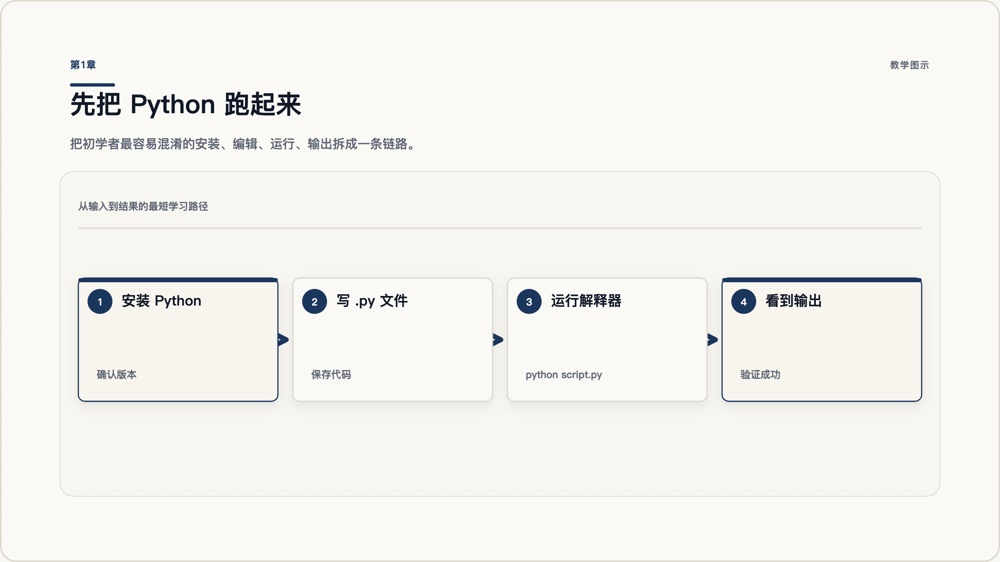
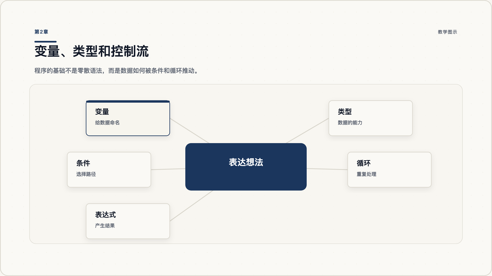
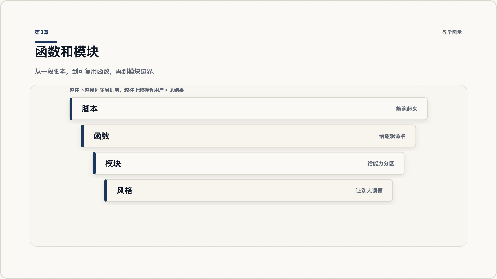
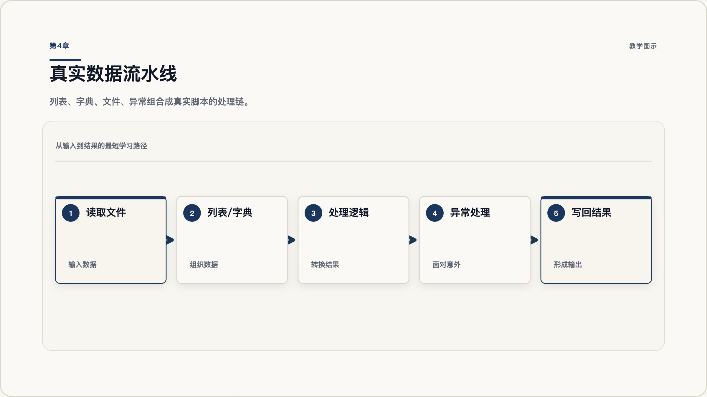
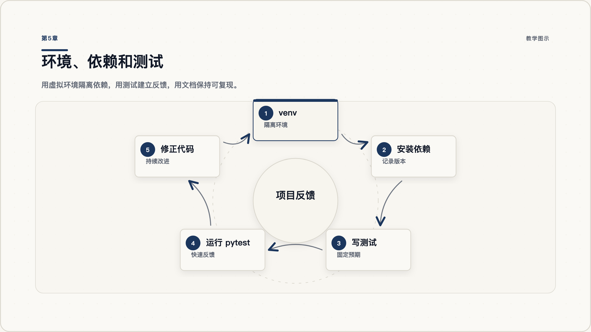
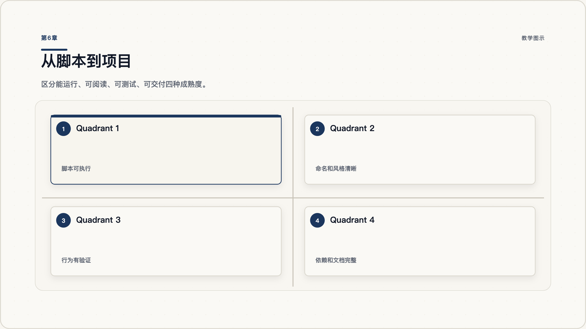

# Python 从入门到精通：把语法变成可维护的小项目

很多人学 Python 的第一反应，是打开一张语法清单：变量、列表、字典、函数、类、模块、异常、包管理、测试。看起来每个词都不难，但学到第三天就会卡住：我好像都见过，可是为什么还是写不出一个真正能用的小程序？

问题通常不在记忆力，而在学习路径。Python 不是一堆语法点的集合，它更像一条逐步变清晰的工作流：先让代码跑起来，再用数据表达现实问题，再用条件和循环推动数据变化，再用函数和模块减少混乱，最后用虚拟环境、测试和项目结构让代码可以被自己和别人长期维护。

这份教程不会承诺一篇文章让你“精通所有 Python 领域”。更准确的目标是：帮你搭好从零基础到独立完成小项目的主干。你会知道每个阶段要学什么、为什么学、怎么检查自己是否真的会了，以及下一步该往哪里深入。

## 第1章 先把 Python 跑起来

### 1.1 从代码文件到运行结果

第一章的目标很小：你要能写一个 `.py` 文件，运行它，并知道电脑为什么会给你一个结果。初学者常常急着问“列表和字典有什么区别”，但如果还没有建立“代码文件 -> 解释器 -> 输出结果”的闭环，后面所有语法都会漂在空中。



图 1.1：先建立从代码到结果的闭环，再开始扩展语法。

Python 程序通常由解释器执行。你写下 `print("Hello, Python")`，保存为 `hello.py`，再在命令行运行 `python hello.py`。如果屏幕出现文字，你就完成了第一条路径：文本形式的代码，被 Python 解释器读取，并转化为可见输出。

### 1.2 Python 程序如何执行

可以把 Python 想成一个严格但友好的执行者。它会从上到下读取你的文件，遇到表达式就计算，遇到函数调用就执行对应动作，遇到错误就停下来告诉你哪里不对。你不需要一开始理解解释器内部实现，但要知道：程序不是“写给自己看的笔记”，而是写给解释器执行的指令。

一个最小练习是写三行代码：

```python
name = "Yao"
message = f"Hello, {name}"
print(message)
```

这里发生了三件事：第一行创建数据，第二行加工数据，第三行输出结果。后面的所有程序，基本都在重复这三类动作：创建、加工、输出。

### 1.3 常见坑

最常见的坑是没有区分“编辑器里写了代码”和“终端里运行了代码”。写完文件不代表程序已经执行。另一个坑是电脑里可能有多个 Python 版本，所以正式学习时要记录自己使用的版本。具体项目应以本机环境和项目要求为准，先确认版本，再开始写代码。

### 1.4 用三步确认已经入门

你能做到这三件事，就算真正完成第一章：能在命令行确认 Python 版本；能运行一个 `.py` 文件；能解释 `print()` 为什么会在屏幕上显示结果。

## 第2章 用变量、类型和流程控制表达想法

### 2.1 先让数据有名字

第二章的目标是理解程序如何“记住信息”和“选择下一步”。变量不是数学课里的未知数，而是给数据贴的名字。类型不是考试概念，而是数据能做什么事情的说明。流程控制则决定程序接下来走哪条路。



图 2.1：变量保存状态，类型决定能力，控制流推动程序前进。

### 2.2 数据类型不是名词表

例如，字符串适合处理文本，数字适合计算，列表适合保存一组有顺序的数据，字典适合保存“键和值”的映射。你不需要一开始背完所有方法，只要能回答一个问题：我现在面对的数据，更像一个文本、一串数字、一组项目，还是一张对应关系？

```python
student = {
    "name": "Lina",
    "score": 86,
    "passed": True
}
```

这段代码里，字典把一个学生的多个信息放在一起。你可以通过 `student["score"]` 取出分数，再用条件判断决定输出什么。

### 2.3 if、for、while 的分工

`if` 负责选择，`for` 负责遍历，`while` 负责在条件成立时持续重复。很多初学者会把控制流理解成“语法格式”，但更好的理解是：你正在设计程序的行动路线。

```python
scores = [72, 91, 58, 80]

for score in scores:
    if score >= 60:
        print("通过")
    else:
        print("需要复习")
```

这个例子里，列表提供数据，`for` 让程序逐个处理，`if` 决定每个分数走哪条路径。

### 2.4 用订单清单做一次小练习

给你一个“订单金额列表”，你能写程序算总金额、找出大于 100 的订单，并输出对应提示，就说明你已经能用变量、类型和流程控制表达一个简单业务问题。

## 第3章 用函数和模块减少混乱

### 3.1 把重复逻辑装进函数

当代码只有十行时，你可以从上到下读完；当代码有一百行时，如果没有函数，程序会变成一整块难以修改的文字。函数的价值不是“高级”，而是把一段有名字、有输入、有输出的逻辑单独拎出来。



图 3.1：函数给逻辑命名，模块给能力分区。

### 3.2 函数是给一段逻辑命名

看下面这个函数：

```python
def is_passed(score):
    return score >= 60
```

它把“判断是否及格”这件事命名为 `is_passed`。以后你看到 `is_passed(86)`，就不需要重新理解里面的比较逻辑。函数让程序更像一组可以组合的动作，而不是一串临时写下的命令。

一个好函数通常具备三个特征：名字能说明意图；输入参数清晰；返回结果可预测。虽然每个团队可以有自己的规则，但初学者应该尽早养成清晰命名和统一格式的习惯。

### 3.3 模块是给一组能力分区

当函数继续增多，就需要模块。模块可以简单理解为一个 `.py` 文件，它把相关能力放到一起。例如，你可以把成绩计算函数放在 `score_utils.py`，再在主程序里导入：

```python
from score_utils import is_passed

print(is_passed(86))
```

这一步的意义很大：你的程序开始有边界了。主程序负责流程，工具模块负责具体能力。边界清晰，后面测试和维护才会变得容易。

### 3.4 把成绩脚本拆成两个函数

把上一章的成绩判断脚本改造成两个函数：`average(scores)` 和 `passed_scores(scores)`。如果主程序只剩下“准备数据、调用函数、打印结果”，你就理解了函数的第一层价值。

## 第4章 处理真实数据：列表、字典、文件和异常

### 4.1 从课堂练习进入真实文件

真实程序很少只处理写死在代码里的数据。它通常要读取文件、解析内容、处理异常，再把结果保存起来。第四章的目标是把 Python 从“课堂练习”推进到“真实脚本”。



图 4.1：真实脚本要处理输入、转换、异常和输出。

### 4.2 数据结构服务于问题

列表适合保存多个同类项目，字典适合保存结构化信息。比如你读取一个 CSV 文件后，可能把每一行变成一个字典，再把所有行放进列表：

```python
students = [
    {"name": "Lina", "score": 86},
    {"name": "Kai", "score": 55},
]
```

这样组织数据后，你就可以遍历列表、读取字典字段、计算通过率。数据结构不是为了炫技，而是为了让问题更容易被程序处理。

### 4.3 文件和异常让脚本接近真实世界

读取文件时，文件可能不存在；解析内容时，数据可能格式错误；写入结果时，路径可能没有权限。异常处理就是让程序面对意外时不要直接崩掉，而是给出更明确的反馈。

```python
from pathlib import Path

path = Path("scores.txt")

try:
    content = path.read_text(encoding="utf-8")
except FileNotFoundError:
    print("找不到 scores.txt，请先准备数据文件。")
else:
    print(content)
```

这里的 `try/except/else` 把“可能失败的动作”和“失败后的处理”分开了。你不需要一开始掌握所有异常类型，但要养成一个意识：真实世界的输入不一定可靠。

### 4.4 读取分数文件并写出结果

准备一个文本文件，每行一个分数。写程序读取它，计算平均分，并把结果写入 `result.txt`。如果文件不存在，程序要提示用户，而不是直接显示一堆看不懂的错误栈。

## 第5章 第三方库、虚拟环境和测试

### 5.1 给项目准备独立环境

学到这里，你已经能写脚本。但只靠标准库不够，真实项目经常需要第三方库。问题是：如果你随便把库装到系统 Python 里，不同项目的依赖会互相污染。第五章要解决的是项目环境和反馈机制。



图 5.1：虚拟环境隔离依赖，测试提供反馈。

### 5.2 为什么需要虚拟环境

虚拟环境相当于给每个项目准备一个独立房间。这个项目需要 A 版本的库，另一个项目需要 B 版本的库，它们可以互不影响。Python 标准库提供了 `venv` 用于创建虚拟环境。

常见流程是：

```bash
python -m venv .venv
source .venv/bin/activate
python -m pip install requests
```

Windows、macOS、Linux 的激活命令略有差异，所以正式操作要看对应系统说明。更重要的是理解原则：依赖属于项目，不应该随手污染全局环境。

### 5.3 用测试建立反馈

测试不是大公司才需要的东西。只要你写了函数，就可以写一个小测试确认它还按预期工作。pytest 是 Python 社区常用的测试框架，适合从简单测试开始。

```python
def average(scores):
    return sum(scores) / len(scores)

def test_average():
    assert average([80, 90, 100]) == 90
```

当你运行测试时，程序会告诉你行为是否符合预期。以后你修改 `average`，测试就像一个提醒器，帮你发现自己有没有改坏原来的功能。

### 5.4 用两条测试保护成绩项目

给成绩项目创建虚拟环境，安装 pytest，写两个测试：一个测试平均分，一个测试及格筛选。能跑通测试，就说明你开始从“能运行”走向“能验证”。

## 第6章 从脚本到可维护项目

### 6.1 用项目标准重新看 Python

“从入门到精通”不是学完所有语法，而是逐步把代码写得可运行、可阅读、可测试、可交付。第六章给你一个继续成长的框架。



图 6.1：成熟项目不只是能跑，还要可读、可测、可交付。

### 6.2 组织结构、风格和类型提示

一个小项目可以从这样的结构开始：

```text
score_project/
  pyproject.toml
  src/
    score_project/
      __init__.py
      core.py
  tests/
    test_core.py
  README.md
```

这不是唯一结构，但它提醒你：项目不只有代码文件，还包括依赖配置、测试、文档和入口。关于代码可读性，稳定的风格规则仍然是重要基准。如果你想理解 Python 本身如何作为工程项目维护，可以浏览 CPython 仓库，但初学阶段不需要读源码。

类型提示也是继续进阶的重要工具。它不能替代测试，但可以让函数输入输出更清楚：

```python
def average(scores: list[int]) -> float:
    return sum(scores) / len(scores)
```

这行代码告诉读者：`scores` 应该是一组整数，结果是浮点数。随着项目变大，这种清晰度会越来越重要。

### 6.3 一个小项目如何继续长大

继续练习时，不要只刷语法题。更好的路径是做小而完整的项目：命令行记账工具、文件批量重命名工具、网页数据清洗脚本、个人阅读清单管理器。每个项目都按同一标准推进：

1. 能运行：有一个清晰入口。
2. 可阅读：命名、函数和模块边界清楚。
3. 可测试：核心逻辑有测试。
4. 可交付：依赖、README、运行命令完整。

研究公开代码时也要保持谨慎。网上的片段不一定能直接运行；你要关注版本、依赖和上下文。理解一个项目也不能只看代码，还要看 README、配置、示例和测试。

### 6.4 把成绩脚本整理成最小项目

把前面的成绩脚本整理成一个最小项目：`core.py` 里放计算逻辑，`tests/` 里放测试，`README.md` 写清楚如何创建环境、安装依赖、运行测试。完成后，你就不只是“会写 Python 语法”，而是开始理解 Python 项目如何被维护。

## 下一步

如果你是零基础，下一步不要追求一次学完所有方向。先完成三个项目：一个文件处理脚本、一个命令行小工具、一个带测试的小包。每做一个项目，都检查同一件事：我是否能解释数据从哪里来、经过哪些函数、遇到错误怎么办、如何验证结果正确、别人如何运行它。

当你能持续回答这些问题，Python 就不再是一本语法书，而会变成你解决问题的工具箱。

## 延伸阅读

- Python 官方文档：https://docs.python.org/
- The Python Tutorial：https://docs.python.org/3/tutorial/
- venv 虚拟环境文档：https://docs.python.org/3/library/venv.html
- Python Packaging User Guide：https://packaging.python.org/
- PEP 8 代码风格指南：https://peps.python.org/pep-0008/
- pytest 文档：https://docs.pytest.org/en/stable/
- CPython 仓库：https://github.com/python/cpython
- Gistable: Evaluating the Executability of Python Code Snippets on GitHub：https://arxiv.org/abs/1808.04919
- What's in a GitHub Repository? A Software Documentation Perspective：https://arxiv.org/abs/2102.12727
